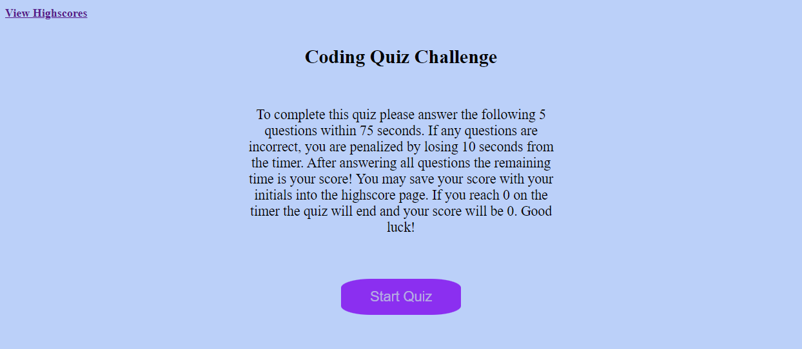

# Technical Assessment Quiz

## Description

This timed quiz is a short assessment of technical knowledge of Javascript. There are 5 questions in total and 75 seconds to complete the quiz. This is to test peoples knowledge on basic Javascript and Web API. This quiz is entirely made with Javascript, with some very basic HTML and CSS.

## Usage

Access website here: [Coding Quiz](https://annie-mcelroy.github.io/coding-quiz/)

Follow the below instructions to play the quiz:
- To play the quiz, select "Start Quiz" after reading the intro.
- Afterwards select the answer of your choosing for each question.
- If you run out time, the quiz will end. When you finish answering all the questions, the quiz will end.
- At end of quiz, you can save your score (time left) to the Highscore page by submitting your Initials.
- Then repeat and play again until you get the highest score! 

## License

MIT License

Copyright (c) 2023 Annie McElroy

Permission is hereby granted, free of charge, to any person obtaining a copy
of this software and associated documentation files (the "Software"), to deal
in the Software without restriction, including without limitation the rights
to use, copy, modify, merge, publish, distribute, sublicense, and/or sell
copies of the Software, and to permit persons to whom the Software is
furnished to do so, subject to the following conditions:

The above copyright notice and this permission notice shall be included in all
copies or substantial portions of the Software.

THE SOFTWARE IS PROVIDED "AS IS", WITHOUT WARRANTY OF ANY KIND, EXPRESS OR
IMPLIED, INCLUDING BUT NOT LIMITED TO THE WARRANTIES OF MERCHANTABILITY,
FITNESS FOR A PARTICULAR PURPOSE AND NONINFRINGEMENT. IN NO EVENT SHALL THE
AUTHORS OR COPYRIGHT HOLDERS BE LIABLE FOR ANY CLAIM, DAMAGES OR OTHER
LIABILITY, WHETHER IN AN ACTION OF CONTRACT, TORT OR OTHERWISE, ARISING FROM,
OUT OF OR IN CONNECTION WITH THE SOFTWARE OR THE USE OR OTHER DEALINGS IN THE
SOFTWARE.